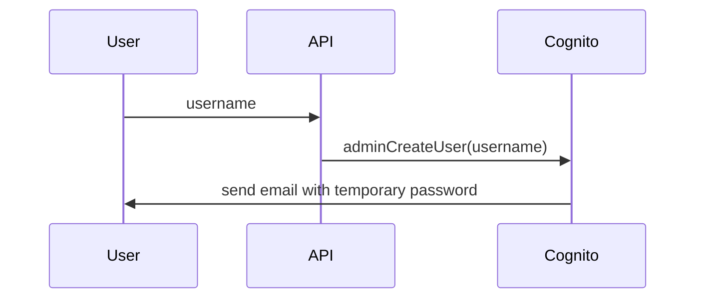

# AWS Cognito
LaravelでAWS Cognitoを使ってみる。

## IAMユーザ作成
ルートユーザを使って、作業用のIAMユーザを作成する

## AWS SDKをインストール
[参考](https://docs.aws.amazon.com/ja_jp/sdk-for-php/v3/developer-guide/getting-started_installation.html)

- composerを使ってインストール
```bash {iscopy=true}
composer require aws/aws-sdk-php
```

## APIルートを有効化
[参考](https://readouble.com/laravel/11.x/ja/routing.html)

- artisanコマンドを使用して、APIルーティングを有効化
```
sail artisan install:api
```

## フロントエンドセットアップ
### Nuxtをインストール
```bash {iscopy=true}
npx nuxi init front
```

### LaravelのAPIを呼べるか確認

### ログイン画面

### ログイン後の画面

## Cognito
### ユーザプール作成
- Cognito Identity Providerともいう
- 一旦AWSマネジメントコンソールで作成
  - できればIaC化したい
- アプリケーションクライアント
  - `ALLOW_ADMIN_USER_PASSWORD_AUTH`を有効化する

#### 設定値


### サインアップ

### adminCreateUser
管理者権限でユーザを作成する

- Username(required)
  - ユーザプールの設定で`UserNameAttributes`に`phone_number`, `email`または`phone_number|email`を設定しているとする(今回はemail)
  - Usernameにemail形式の文字列を入れるとCognito側で自動で判断して、入力した値をユーザのemail属性に設定して登録してくれる。[参考](https://docs.aws.amazon.com/ja_jp/cognito/latest/developerguide/user-pool-settings-attributes.html#user-pool-settings-aliases)
- UserPoolId(required)
  - ユーザプールIDを渡す

必須項目は上記2つのみ。

ステータスが`FORCE_CHANGE_PASSWORD`のユーザが作成される

一時パスワードがメールで送信される

### adminInitiateAuth
ユーザ名とパスワードを使用してログインする

- AuthFlow
  - 用いる認証フローを指定
  - 今回は`ADMIN_USER_PASSWORD_AUTH`を用いる
- AuthParameters
  - AuthFlowで`ADMIN_USER_PASSWORD_AUTH`を指定した場合、以下の情報が必要
    - USERNAME
    - PASSWORD
    - SECRET_HASH
      - アプリクライアントの設定でクライアントシークレットを指定した場合(?)
      - 計算方法は[こちら](https://docs.aws.amazon.com/cognito/latest/developerguide/signing-up-users-in-your-app.html#cognito-user-pools-computing-secret-hash)

`adminCreateUser`で作成した、ステータスが`FORCE_CHANGE_PASSWORD`のユーザで、メールで送信された一時パスワードを用いてログインしようとしたら認証エラー

`adminSetUserPassword`でパスワードを変更したユーザ(ステータスが`FORCE_CHANGE_PASSWORD`, `CONFIRMED`どっちも)でログインしたら認証成功

### adminSetUserPassword
管理者権限でパスワードを設定する

- Permanent
  - true
    - パスワードを永続的に設定
    - ステータスが`CONFIRMED`になる
  - false
    - 一時パスワードとして設定する
    - ステータスが`FORCE_CHANGE_PASSWORD`になる

### signUp(これは使わない)
- SecretHash
  - `username`, `cliend_id`, `client_secret`をsha256でハッシュ化して、base64エンコードしたものを渡す
- username
  - これが何かいまいちわからない
- sub
  - 勝手に生成されて登録されていた
- user_id
  - 勝手に生成されて登録されていた

### ログインの仕組み
色々な方法があるが、今回は`USER_PASSWORD_AUTH`を用いる

### ログインAPI作成

## 参考
- [AWS BlackBelt Amazon Cognito](https://pages.awscloud.com/rs/112-TZM-766/images/20200630_AWS_BlackBelt_Amazon_Cognito_ver2.pdf)


## TODO
- 認証機能作成
- adminCreateUserで作成したユーザのログインを考える
