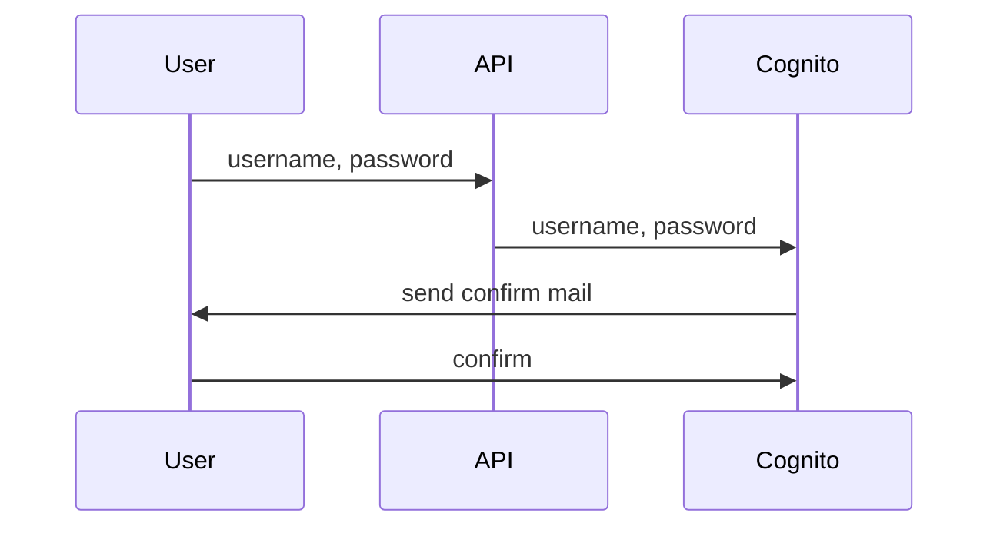

# AWS Cognito
LaravelでAWS Cognitoを使ってみる。

## IAMユーザ作成
ルートユーザを使って、作業用のIAMユーザを作成する

## AWS SDKをインストール
[参考](https://docs.aws.amazon.com/ja_jp/sdk-for-php/v3/developer-guide/getting-started_installation.html)

- composerを使ってインストール
```bash {iscopy=true}
composer require aws/aws-sdk-php
```

## APIルートを有効化
[参考](https://readouble.com/laravel/11.x/ja/routing.html)

- artisanコマンドを使用して、APIルーティングを有効化
```
sail artisan install:api
```

## フロントエンドセットアップ
### Nuxtをインストール
```bash {iscopy=true}
npx nuxi init front
```

### LaravelのAPIを呼べるか確認

### ログイン画面

### ログイン後の画面

## Cognito
### ユーザプール作成
- Cognito Identity Providerともいう
- 一旦AWSマネジメントコンソールで作成
  - できればIaC化したい

### サインアップ

### ログインの仕組み
色々な方法があるが、今回は`USER_PASSWORD_AUTH`を用いる

### ログインAPI作成

## 参考
- [AWS BlackBelt Amazon Cognito](https://pages.awscloud.com/rs/112-TZM-766/images/20200630_AWS_BlackBelt_Amazon_Cognito_ver2.pdf)


## TODO
- 認証機能作成
